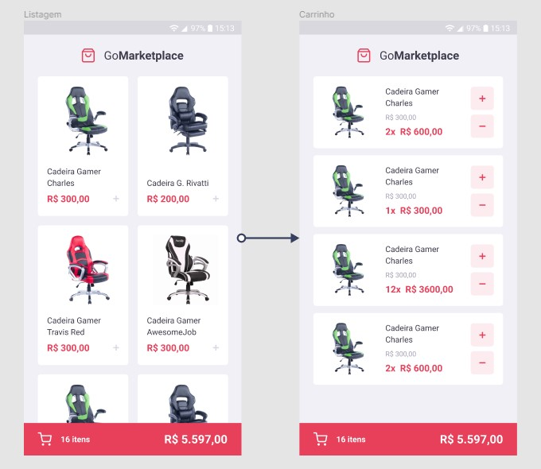

# 🚀 GoStack Challenge: GoMarketplace
This is a challenge of Rocketseat's GoStack bootcamp. It is an application that connects to a fake API to simulate an e-commerce, allowing the addition of items to the cart and finalization of the purchase.

## ⚙️ Technologies
- React Native
- TypeScript
- Axios
- Context API
- Async Storage
- Styled-components
- ESLint e Prettier

## 🤔 How to contribute

- Fork this repository;
- Create a branch with your changes: `git checkout -b my-feature`;
- Commit your changes: `git commit -m 'feat: my new feature'`;
- Push your branch: `git push origin my-feature`.

## 📜 License

> This project is under the MIT license. See the archive [LICENSE](https://github.com/jessicafpx/gostack-desafio-fundamentos-react-native/blob/master/LICENSE.md) for more details.
---

##### 
 <strong> < desenvolvido por <a href="github.com/jessicafpx"> @jessicafpx</a> /></strong> 👋
